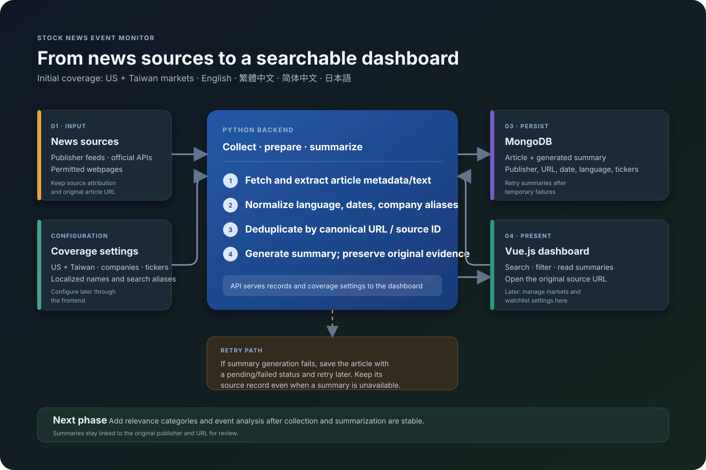
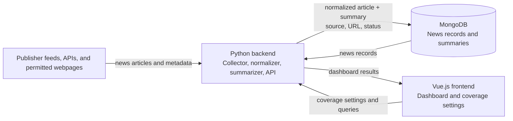
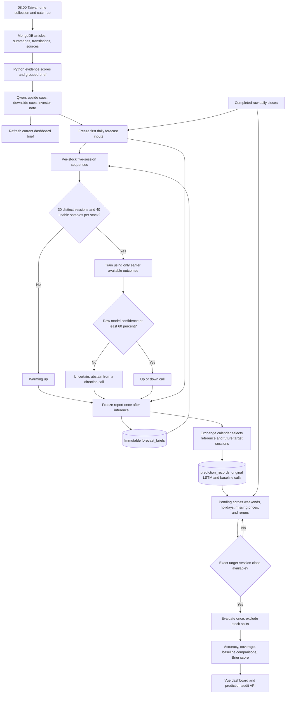

# Stock News Event Monitor

A Python project for collecting and organizing company and market news related to the US and Taiwan markets in English, Traditional/Simplified Chinese, and Japanese. News is collected, summarized, and stored with its source attribution and URL so it can be reviewed in a future dashboard and used for later event analysis.

> News analysis can help surface information for research. It does not guarantee future outcomes or provide investment advice.

## Project goals

- Start with the US and Taiwan markets, with market and company coverage designed to be configurable from the frontend later.
- Collect news relevant to selected companies, tickers, industries, and markets.
- Support English, Chinese (繁體中文 and 简体中文), and Japanese (日本語) search terms and article text.
- Capture the original publication time, source/publisher, headline, URL, language, and available article text.
- Avoid duplicate articles and retain source links so results can be checked against the original reporting.
- Summarize collected news before saving the completed record to MongoDB, while retaining the original source metadata.
- Make saved records usable by later steps for relevance categorization, event classification, and review of possible market implications.

## Planned workflow

1. **Configure coverage** — choose markets, companies, tickers, languages, and search aliases. Initial markets are the US and Taiwan.
2. **Discover and extract** — retrieve candidate stories through permitted publisher feeds, APIs, or pages, then normalize metadata and dates.
3. **Deduplicate and summarize** — identify duplicates and create a concise summary while keeping the original title, source, and URL.
4. **Save to MongoDB** — insert or update the normalized article and summary. If summarization fails, retain the article record with a retryable summary status so collection does not lose it.
5. **Serve the dashboard** — the Python backend provides records and configuration to the Vue.js frontend, which displays news and filters.
6. **Validate over time** — compare daily direction calls with the next trading session's close and track model performance without treating the LSTM score as a price forecast.

The original article metadata and source link are the evidence; summaries and later analysis are derived outputs. Detailed relevance taxonomy remains future work, while a lightweight rule-based evidence-priority pass helps the local analysis model review the current stories.

## Architecture

The application uses MongoDB for persistence, Python services for scheduled collection and dashboard API access, and a Vue.js frontend for dashboard display. Docker Compose can run the services together in local development.



The graphic shows the collection path, the backend/database/frontend connections, and the retry path when summarization fails.



The frontend should be able to configure market and watchlist settings through the backend rather than changing scraper code. In the first version, configuration can be simple; user accounts and per-user watchlists can be considered later if needed.

## Article data fields

Each article record should preserve as much of the following as the source provides:

| Field | Description |
| --- | --- |
| `title` | Original headline, in its original language |
| `title_en` | English headline translation; equals `title` when the source is English |
| `url` | Canonical article URL |
| `source` | Publisher domain, feed name, feed URL, and source type |
| `published_at` | Publication/update timestamp normalized to UTC |
| `collected_at` | UTC timestamp when this project collected the record |
| `language` | Feed/source language (`en`, `zh-Hant`, `zh-Hans`, `ja`, etc.) |
| `markets` | Relevant market labels, initially US or Taiwan |
| `entities` | Matched watchlist companies, tickers, listings, and markets |
| `topics` | Matched global topics such as oil/energy, conflict, bonds/rates, FX, or tax/trade policy |
| `summary.text` | Summary in the source language |
| `summary.text_en` | English summary translation; equals `summary.text` for English stories |
| `summary.status` | Summary state such as `complete` or `failed` |
| `translation.status` | Translation state such as `complete`, `not_needed`, or `failed` |
| `content_storage` | Indicates that only metadata and summaries are stored; extracted article text is transient |

MongoDB is the planned persistent store. A normalized URL or publisher-provided article ID can be used to prevent duplicate records where possible.

## Initial watchlist

The first watchlist includes:

- Public companies: TSMC, Tesla (`TSLA`), Meta (`META`), Google/Alphabet (`GOOGL`/`GOOG`), Apple (`AAPL`), and NVIDIA (`NVDA`). Taiwan listings and company aliases should also be included where relevant (for example, TSMC's Taiwan listing).
- Private companies: SpaceX, OpenAI, and Anthropic. These do not have public stock tickers, but their news can be tracked by company names, aliases, and related public-company connections.

Company names, ticker symbols, localized names, and aliases should be configurable so the watchlist can expand and eventually be managed from the frontend. The watchlist identifies topics to collect; relevance categorization will be a separate later step.

## Python collector (initial implementation)

The Python collector reads configured RSS/Atom feeds, GDELT results, and optional Media Cloud search results, extracts article text when accessible, and keeps stories that match either a watchlist company or a configured global topic. It summarizes locally, translates the headline and summary into English, and upserts the result into MongoDB. The daily collection window is 48 hours ending at the latest 08:00 Asia/Taipei boundary. Entries are processed newest first, up to the configured per-feed limit. Global topic keywords in English, Traditional/Simplified Chinese, and Japanese are maintained in `config/topics.yaml`; GDELT uses English terms for multilingual discovery, then local topic matching assigns tags. GDELT requests are throttled and retried after rate limits; Media Cloud and publisher RSS feeds provide independent discovery paths if GDELT is unavailable. Extracted full article text is used temporarily and is not stored; MongoDB retains original and English wording, source details, URL, date, language, markets, matched companies, topic tags, and summaries. If summarization or translation fails, the record and failure status are saved so the relevant step can be retried on a later run.

The local summarizer uses `csebuetnlp/mT5_multilingual_XLSum` to summarize in the source language. A separate local translation step creates the English headline and summary: `Helsinki-NLP/opus-mt-zh-en` for Chinese and `Helsinki-NLP/opus-mt-ja-en` for Japanese. English headlines and summaries are copied directly. The original-language `title` and `summary.text` are kept alongside `title_en` and `summary.text_en`, so the translation is convenient for display and downstream models while the source-language wording remains available for comparison. The model checkpoints are cached after the first run. Device selection is automatic (CUDA, Apple Metal, or CPU) unless configured otherwise. The Chinese translation model card labels its input language “Chinese”; review Traditional Chinese translation quality on representative Taiwan headlines before relying on it for analysis. See the [Chinese model card](https://huggingface.co/Helsinki-NLP/opus-mt-zh-en) and [Japanese model card](https://huggingface.co/Helsinki-NLP/opus-mt-ja-en) for model details and licenses.

The scheduled backend builds a daily brief from all collected MongoDB articles in the active 08:00 Taiwan-time window. Before analysis, Python creates a transparent evidence brief grouped by ticker and global topic. Each story receives a 0–100 priority score based on direct watchlist relevance, source traceability, freshness, and duplicate-title count. This is a review-ranking aid only: it is not direction, source credibility, a probability, or an expected price move. [`Qwen/Qwen2.5-0.5B-Instruct`](https://huggingface.co/Qwen/Qwen2.5-0.5B-Instruct) receives this brief and the scored articles in small batches, then generates source-linked upside/downside cues and the investor note. Cue ranking combines the model's separate cue confidence with evidence priority. The dashboard displays the evidence brief before the cues and keeps model confidence separate from evidence priority. If Qwen cannot load or produce a valid result, FinBERT sentiment is shown as an explicitly labeled fallback, and the daily note falls back to the local summarizer. First use downloads model weights into Docker's persistent `hf_cache` volume. Set `NEWS_ANALYSIS_MODEL_NAME` and `NEWS_ANALYSIS_MODEL_DEVICE` to configure Qwen. These outputs are hypotheses from a small local model, not reliable price forecasts; inspect the linked sources.

The first-pass story priority is computed as `100 × relevance × source_traceability × freshness × novelty`. Relevance is `1.0` for a direct watchlist match, `0.65` for a global-topic story, and `0.35` otherwise. Traceability is `1.0` when both publisher and URL are present, `0.65` for a URL alone, `0.35` for a publisher alone, and `0.2` when neither is present. Freshness decreases linearly with age and is bounded from `0.5` to `1.0`; missing dates receive `0.5`. Novelty is `1 / sqrt(duplicate-title count)`. The model's cue confidence remains a separate 0–1 field; the combined ranking value is `cue confidence × priority / 100`. These initial weights are transparent heuristics and should be reviewed against stored outcomes before being treated as useful predictors.

### Evidence scoring, frozen predictions, and LSTM validation

Python creates the news evidence brief before Qwen generates the upside/downside cues and investor note. LSTM v2 is trained independently for each public security. It uses the first frozen report for each completed market session, with five consecutive sessions of close changes and news-direction scores as input. Exchange calendars resolve US (`XNYS`) and Taiwan (`XTAI`) sessions, including scheduled holidays and early closes; see the [exchange_calendars documentation](https://github.com/gerrymanoim/exchange_calendars).



Only completed reference bars can support a forecast. The target is the first exchange-session close **after actual issuance**, rather than after the news-window cutoff. Every original record stores its issuance time, security, reference close/date, target session/close time, model version, article IDs, input features, and training cutoff. Forecast inputs are inserted once per report date. A security/model/target-session key prevents weekend reports or collection retries from replacing or multiplying an existing call. The live news dashboard can refresh while the original calls remain frozen.

LSTM training requires at least **30 distinct completed-session observations and 40 usable training samples for each security**, with both up and down labels. Forty five-session training samples generally require at least 45 observations, and gaps can require more. Weekend reports do not add observations. Missing sessions break a sequence; unchanged prices and splits do not become direction-training labels. Each training target must have closed before forecast issuance. Training and evaluation start with the new immutable records; old mutable briefs are retained but are not treated as verified v2 inputs or scores.

An LSTM class confidence below `0.60` produces `uncertain`. Three baselines are recorded alongside it: always up, previous-session direction, and the original news-only direction (which may also abstain). Predictions remain pending until the exact target price is available; a later price never substitutes for a missed target. Price retrieval expands back to the earliest pending reference date so missed runs can recover exact outcomes. Scheduled or unplanned closures not represented by the installed calendar can leave a record pending for review; calendar mappings and holiday data should be maintained as market coverage grows.

Accuracy counts correct up/down calls divided by evaluated directional calls; a flat actual close counts as incorrect. Coverage counts directional calls divided by all matured, non-excluded forecasts, including uncertain forecasts. Stock splits between reference and target are excluded because raw-close comparisons cross different share units. Overall baseline metrics are shown with separate comparisons on matched LSTM calls sharing a security, target session, and issuance batch. Brier score and confidence bins evaluate raw probabilities on binary up/down outcomes, including abstained forecasts. **Confidence remains uncalibrated**: these metrics help assess calibration but do not turn it into a validated probability. LSTM outputs currently do not feed Qwen suggestions.

Inspect original calls through `/api/predictions?model=lstm&status=pending&limit=50`; accepted models are `lstm`, `always_up`, `previous_direction`, and `news_only`, and statuses are `pending`, `evaluated`, and `excluded`. `/api/dashboard` and `/api/history` return validation metrics, per-security training coverage, and baseline comparisons. Earlier legacy evaluations stay in archived briefs and are excluded from the v2 totals.

Run the focused regression suite with:

```bash
python -m pip install -e ".[local-model,test]"
python -m unittest discover -s tests -v
```

### What the Python code is responsible for

The Python backend includes a command-line collector, a scheduled refresh process, and an HTTP API. The scheduler checks once per minute for a missing completed window and collects a configurable number of hours ending at the most recent 08:00 Asia/Taipei boundary (48 hours by default). This catches up after a restart or a missed 08:00 boundary, such as when Docker Desktop or its host is asleep. Failed runs are retried after 15 minutes. The Vue page reads saved results through the API; it does not start a scrape when a visitor opens the page.

| Module | Responsibility |
| --- | --- |
| `src/stock_news/cli.py` | Starts a collection run: reads configuration and environment settings, connects to MongoDB, loads the summarization model, runs each feed, and prints the totals. |
| `src/stock_news/config.py` | Loads and validates the source and watchlist YAML files, and reads settings such as the MongoDB connection and model name from environment variables. |
| `src/stock_news/collector.py` | Fetches RSS/Atom feeds, orders dated stories newest first, keeps stories published within the configured age window, extracts article text, matches companies, calls summarizer and translator, and upserts records. Full article text is used temporarily and is not saved. |
| `src/stock_news/mediacloud_source.py` | Builds multilingual Media Cloud searches for configured market topics and watchlist terms, then normalizes story metadata for the collector. |
| `src/stock_news/summarizer.py` | Provides the summarizer interface and its current local Hugging Face mT5 implementation. It selects CUDA, Apple Metal, or CPU and generates a short summary from the article text or available feed text. |
| `src/stock_news/translation.py` | Lazily loads the local Chinese-to-English or Japanese-to-English model, translates headlines and summaries, and supports a one-time backfill for existing MongoDB records missing English fields. English text passes through unchanged. |
| `src/stock_news/impact.py` | Provides the FinBERT financial-sentiment fallback when the local impact generator cannot run. |
| `src/stock_news/evidence_brief.py` | Calculates per-story evidence-priority components and creates a ticker/global-topic brief for Hugging Face. Priority is a transparent ranking aid, not a prediction. |
| `src/stock_news/storage.py` | Connects to MongoDB's `stock_news.articles` collection and creates indexes for deduplication and common date, market, company, and language queries. |
| `src/stock_news/local_analysis.py` | Supplies the evidence brief and per-story scores to the local Qwen instruction model, then produces source-linked upside/downside cues, watchlist direction calls, and the daily investor note. Model confidence remains separate from evidence priority. |
| `src/stock_news/daily_briefs.py` | Builds the 08:00 Taiwan-time brief, snapshots daily closing prices, archives the previous brief, freezes original forecasting inputs and processes all pending calls when exact target-session closes are available. |
| `src/stock_news/lstm.py` | Trains an independent LSTM per security on frozen, chronological session sequences after 30 observations and 40 usable samples; emits up/down or uncertain and reports per-stock coverage. |
| `src/stock_news/trading_sessions.py` | Resolves completed reference sessions and future target closes using US/Taiwan exchange calendars. |
| `src/stock_news/forecast_tracking.py` | Stores immutable original calls, evaluates exact target closes idempotently, and calculates accuracy, coverage, baselines, and raw-probability diagnostics. |
| `src/stock_news/api.py` | Serves the dashboard's latest completed Taiwan-time news window, saved daily brief, history, validation data, and stock quote/history data. |
| `src/stock_news/scheduler.py` | Checks once per minute for a missing completed Taiwan-time window, runs collection, and retries windows that failed without writing a run record. |
| `config/sources.yaml` | Lists RSS/Atom feeds, GDELT settings, and Media Cloud collection IDs and per-run limits. |
| `config/topics.yaml` | Lists global market topics and English, Traditional Chinese, Simplified Chinese, and Japanese matching terms. |
| `config/watchlist.yaml` | Lists companies, tickers, localized names, aliases, and market associations used when matching articles. |
| `config/dashboard.yaml` | Lists the public US and Taiwan tickers displayed in Market Pulse. Private companies remain on the news watchlist but do not have public quotes. |
| `frontend/` | Contains the Vue 3 dark-mode dashboard and its Vite development server. |

For each feed, the collector sorts entries by publication/update date and ignores entries outside the configured collection window (48 hours by default) or without a known date. It reads the linked page when accessible, checks the text against the watchlist and global topic terms, summarizes the story in its source language, and translates the title and summary to English. It skips non-matches and already processed duplicate URLs. Each saved record keeps original and English wording with the publisher/source, canonical URL, date, language, markets, matched entities, and matched topic tags. Translation or summary failures are recorded on the document so a later collection run can retry them.

The global topic list currently covers conflict, oil/energy, government bonds and rates, foreign exchange, and tax/trade policy. In addition to GDELT, `config/sources.yaml` includes official feeds from the US EIA and Federal Reserve, the ECB, and the Bank of Japan, plus optional Media Cloud discovery. Media Cloud requires an API key and at least one selected collection ID; its search results provide story metadata and URLs, after which this collector visits the publisher URL when accessible. Media Cloud reports publication dates without exact times, so stories near the collection-window boundary are assigned an estimated time. Articles are saved only when their titles, summaries, or accessible page text match a configured global topic or company. The local impact model receives every collected company or topic article in the active window, including English translations for Chinese and Japanese stories. Collection remains bounded by configured source coverage; it does not include every news story on the internet. GDELT can be rate-limited (HTTP 429); when that happens, Media Cloud (when configured) and the publisher feeds provide independent paths. The scheduler retries incomplete windows after 15 minutes, but a persistent GDELT limit can keep a run marked incomplete.

### Setup and run

Use Python 3.10 or newer. Start MongoDB in Docker Desktop, then in a terminal at the project folder create a virtual environment and install the project:

```bash
python -m venv .venv
source .venv/bin/activate
cp .env.example .env
python -m pip install -e ".[local-model]"
```

The first install downloads the Python packages. The summarizer, translation, impact-analysis, and fallback checkpoints use additional disk space; Docker caches them in the persistent `hf_cache` volume. The Qwen model loads during the scheduled collection run when the daily brief is generated. The MongoDB URI defaults to `mongodb://localhost:27017`; MongoDB must be running and reachable. Media Cloud stays inactive until you create an API key through [Media Cloud](https://search.mediacloud.org/) and choose one or more relevant collection IDs in its search interface. Add the key to `.env` as `MEDIACLOUD_API_KEY=...` and the selected numeric IDs to `mediacloud.collection_ids` in `config/sources.yaml`. Media Cloud supplies story metadata and URLs; this project fetches accessible publisher pages and creates its own summaries. To feed the configured sources into MongoDB, run:

```bash
stock-news
```

The repository includes the initial company aliases in `config/watchlist.yaml`. Publisher-supported RSS/Atom feeds are listed in `config/sources.yaml`; more feeds can be added as we expand company and language coverage. Apple Newsroom feeds are explicitly associated with Apple so stories that omit the company name still match. Other feeds are matched against company names, aliases, and tickers. Set `NEWS_WINDOW_TIMEZONE`, `NEWS_WINDOW_START_HOUR`, and `NEWS_WINDOW_HOURS` in `.env` to configure the window (defaults: `Asia/Taipei`, `8`, and `48`). For example, `NEWS_WINDOW_HOURS=48` includes news from two days before the latest completed 08:00 Taiwan-time boundary. The collector creates the MongoDB database/collection and indexes on its first run; you do not need to define SQL-style tables or columns in advance.

To check saved records in MongoDB after a run:

```bash
docker compose exec mongodb mongosh stock_news --quiet --eval 'db.articles.countDocuments()'
```

To check the running services and API health:

```bash
docker compose ps
curl -fsS http://localhost:8000/api/health
```

To list saved articles tagged with one or more global topics, including source and URL:

```bash
docker compose exec mongodb mongosh stock_news --quiet --eval 'db.articles.find({topics:{$exists:true,$ne:[]}}, {_id:0,title:1,title_en:1,topics:1,markets:1,url:1,source:1,published_at:1}).sort({published_at:-1}).forEach(printjson)'
```

To inspect recent scheduler activity and feed errors (including GDELT rate limits):

```bash
docker compose logs --tail=100 scheduler
```

Collection totals count articles that were saved or updated, skipped (for example, already known URLs, out-of-window stories, and non-matches), and failed. A high skipped count is expected on repeated runs because the collector avoids reprocessing duplicates. A run with `failed: 0` indicates no source or processing errors for that run; a GDELT HTTP 429 means that source was throttled, even if other feeds succeeded.

To print up to 20 saved articles with clearly labeled original and English headlines/summaries, source links, languages, and publication dates:

```bash
docker compose exec mongodb mongosh stock_news --quiet --eval 'db.articles.aggregate([{$project:{_id:0,"Original Title":"$title","English Title":{"$ifNull":["$title_en",""]},URL:"$url",Language:"$language","Published At":"$published_at",Source:"$source","Original Summary":"$summary.text","English Summary":{"$ifNull":["$summary.text_en",""]}}},{$limit:20}]).forEach(printjson)'
```

To list up to 20 articles published in the last 48 hours, newest first:

```bash
docker compose exec mongodb mongosh stock_news --quiet --eval 'db.articles.aggregate([{$match:{published_at:{$gte:new Date(Date.now()-48*60*60*1000)}}},{$sort:{published_at:-1}},{$limit:20},{$project:{_id:0,"Original Title":"$title","English Title":{"$ifNull":["$title_en",""]},URL:"$url",Language:"$language","Published At":"$published_at","English Summary":{"$ifNull":["$summary.text_en",""]}}}]).forEach(printjson)'
```

Regular collection only processes stories within the configured age window. To translate English fields for older records already in MongoDB, run this one-time backfill. It uses the saved original title and summary and does not fetch or summarize articles again:

```bash
docker compose --profile collector run --build --rm collector stock-news --backfill-english
```

The backfill fills only missing English fields. It may download the local translation models on its first run; subsequent runs can retry any documents whose translation failed.

To inspect articles in DBeaver, connect to `mongodb://localhost:27017`, open the `stock_news` database, expand **Collections**, then right-click **articles** and choose **View Data**. Authentication is currently disabled, so leave the username and password blank.

### Run MongoDB with Docker Desktop

Docker Compose can start MongoDB and persist its data in a named volume:

```bash
docker compose up -d mongodb
docker compose ps
```

The one-shot collector is available as an optional Compose profile. Build and run it with `docker compose --profile collector run --build --rm collector`. Its model cache is persisted between runs. This Python/PyTorch container is configured for CPU inference. To use Apple Metal (MPS) for this model on macOS, run the Python collector on macOS and connect it to the MongoDB container at `mongodb://localhost:27017`.

### Run the dashboard and daily scheduler

Start Docker Desktop, then from the project folder run:

```bash
docker compose --profile app up --build -d
```

Open [http://localhost:5173](http://localhost:5173) for the Vue dashboard and [http://localhost:8000/docs](http://localhost:8000/docs) for the API reference. The scheduler service checks for the latest completed news window once a minute and runs collection at 08:00 Taiwan time. It catches up after startup or a missed boundary if no run is recorded, and retries an incomplete run or a run with failed feeds after 15 minutes. Keep Docker Desktop and the scheduler container running for the daily update. To refresh news manually, run `docker compose --profile collector run --build --rm collector stock-news`.

At each daily collection, the backend analyzes all saved articles published in the 08:00-to-08:00 Taiwan-time window, then stores the generated cues and investor note in `current_brief`. When the next report date begins, the previous brief is copied into `brief_history`; raw article records stay in `articles`. The frontend displays the top five articles and the saved daily analysis. If a window has no matching stories, the brief records that fact and the dashboard may show the latest saved articles with an **Archive Preview** label; older stories are never presented as current-window news. The bottom validation panel scores immutable calls against their exact target-session closes, reports abstention coverage and baseline comparisons, and shows each stock's training progress. LSTM v2 requires 30 completed-session observations and 40 usable samples per security. Earlier mutable-brief evaluations remain archived and are excluded from v2 metrics.

Market Pulse uses the `yfinance` Python client to retrieve the latest available Yahoo Finance quote and one-month daily history for TSLA, TSM (TSMC's US ADR), 2330.TW (TSMC Taiwan), META, GOOGL, GOOG, AAPL, and NVDA. The two Alphabet share classes and both TSMC listings appear as separate securities. SpaceX, OpenAI, and Anthropic are private companies and have no public stock quotes, so they remain in the news watchlist but are not shown as stock cards. Quotes can be delayed, unavailable, or rate-limited; this prototype is not a licensed real-time market data service. See the [yfinance project documentation](https://github.com/ranaroussi/yfinance).

### MongoDB document and indexes

The collector uses database `stock_news` and collection `articles`. Each document represents an article URL and includes original `title` plus `title_en`, source details and URL, `published_at`, `collected_at`, `language`, `markets`, matched `entities`, matched global `topics`, `summary`, `translation`, and `content_storage`. Daily display reports are stored in `current_brief` (one replaceable current report) and `brief_history` (one archived display report per report date). `forecast_briefs` keeps the original immutable daily forecasting inputs and LSTM output. `prediction_records` stores one original call per security/model/target session, with pending/evaluated/excluded status and exact-session outcomes. Legacy evaluations remain in `brief_history`; new metrics come exclusively from `prediction_records`. The `summary` object records source-language `text`, English `text_en`, language, provider, model, generation time, and status. The `translation` object records target language, provider/model, status, and errors. Article identity is a SHA-256 hash of the canonical URL (`article_key`).

Startup creates indexes for unique `article_key` plus publication date and the expected market/date, company/date, and language/date filters. The set is intentionally small and should be adjusted if dashboard query patterns change.

## Responsible collection

- Prefer official APIs, RSS/Atom feeds, and other publisher-supported access methods.
- Check each source's terms, robots instructions, copyright rules, and applicable law before collecting content.
- Use reasonable request rates, identify the client where appropriate, and honor rate limits and access controls.
- Do not bypass paywalls, logins, CAPTCHAs, or other technical restrictions.
- Store only the content needed for the intended research; keep attribution and canonical links.
- Treat scraped text as untrusted input when passing it to downstream models or tools.

## Project status

The local app includes the multilingual Python collector, global topic discovery through GDELT, optional Media Cloud and configured publisher feeds, 08:00 Asia/Taipei scheduler, local Hugging Face daily impact analysis, experimental LSTM direction model and next-session evaluation, FastAPI dashboard API, MongoDB, and Vue dark-mode dashboard. The LSTM needs at least 30 distinct completed-session observations and 40 usable training examples per security before producing predictions. Low-confidence forecasts abstain; confidence remains uncalibrated. The impact model and LSTM are experimental and have not been established as reliable forecasts; topic matches and model-generated stock cues can be noisy, so check the linked original sources before drawing conclusions. Configured discovery uses GDELT, Media Cloud (after its API key and collection IDs are configured), and official RSS sources listed in `config/sources.yaml`; broader publisher coverage, a Taiwan central-bank feed, and US/Taiwan/Japan benchmark bond price/yield series remain future additions.

## Possible next steps

1. Add more permitted US and Taiwan feeds and review company/ticker matching to reduce missed stories and false positives.
2. Review translation quality, especially for Traditional Chinese financial headlines.
3. Evaluate the local impact model and LSTM against a growing history of next-session market closes before treating their outputs as predictions.
4. Replace prototype price retrieval with a licensed market-data provider before public or commercial deployment.

## License

No project license has been selected yet. Until one is added, all rights are reserved by default; check the rights and terms that apply to each collected source independently.
